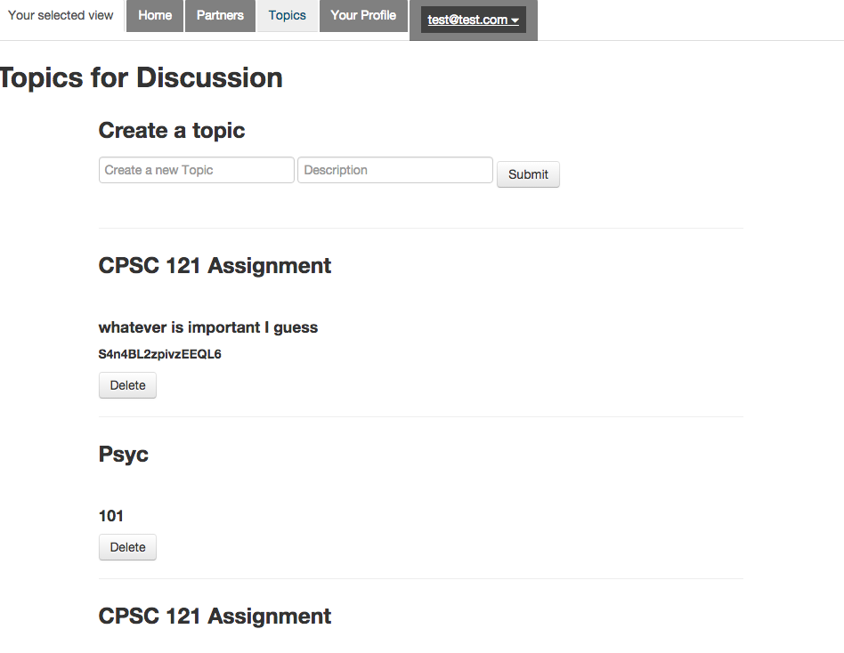

# Partners
Partners is an app that lets you find study partners in real time.
Current deployed version: http://partners2015.mybluemix.net/

This app is completely opensourced! Perfect place if you want to start learning and exploring Meteor.

## How the app works (User work flow)
First thing first, sign up and create a profile. Once you created the profile, you can browse to see all other users' profiles. If you like someone, click "like". If the other person likes you back, you guys will be matched as study partners. You and your study partners can have your private chat rooms, or go to "Topics" page to have a discussion about topics with others.

## For Developers
1. Git clone 
2. Get Iron Router (npm recommended
3. cd partner/app && iron
4. When you are ready to commit, please push to your own branches if you are not sure the branch works with master or not...

## Technology
* Meteor.js
* Bootstrap CSS

## Models / Collections
* Users: Meteor.Users
* Profiles: Each user has one profile
* Topics: Independent of others
* Chat: Coming up
* Likes: Coming up
* Matches: Match exist between 2 profiles, please look at the implementation in profile item js to see how they are matched.

## Sample Data
* Coming soon

## About
Created by Jenny Lian as an open source project for the Meteor community. You can be added as a collaborator as long as you don't engage in destructive work. You can also submit pull request(s) if you like. Msg me on FB, Twitter whatever to be added as a collaborator! Open collaboration! Will deploy regularly based on changes.

## Screenshot (Nov 2015)

* 
* 
* 
* 

## License
Open Source Project - The MIT License (MIT)
https://opensource.org/licenses/MIT
